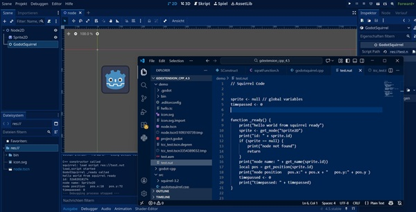

# YaGoSl
Yet another Godot Squirrel

the advantages of YaGoSl are that _ready and _process functions work in squirrel. see the flying sprite on screen!    
its a new script-language for godot. edit your nut-files with the editor of your choice    
and type the name of the .nut-file in the godotsquirrel-node in inspector.    

programmed with godot 4.5, squirrel 3.2. thx to Alberto Demichelis for squirrel.
tested on windows 11.    
    

# commands:       
print(string)    
node = get_node(nodename) // stores the id    
get_name(node.id)    
get_position(node.id)    
set_name and set_position    

firstpic:    



# example test.nut in project demo lets the sprite fly:    
```
// Squirrel Code


sprite <- null // global variables
timepassed <- 0


function _ready() {
    print("hello world from squirrel ready")
    sprite <- get_node("Sprite2D")
    print("id: " + sprite.id)
    if (sprite == null) {
        print("node not found")
        return
    }
    print("node name: " + get_name(sprite.id))
    local pos = get_position(sprite.id)
    print("node position   pos.x:" + pos.x + "   pos.y:" + pos.y )
    timepassed <- 0
    print("timepassed: " + timepassed)
}


function _process(delta) {
    timepassed <- timepassed + delta
    
    if (!sprite) return
    local pos = get_position(sprite.id)
    local new_x = pos.x + timepassed
    local new_y = pos.y
    if (timepassed > 6) {
        timepassed <- 0
        new_x = 0
    }
    set_position(sprite.id, new_x, new_y)
}
```

    
# build:    
put squirrel version 3.2 to directory src/squirrel-3.2    
put godot-cpp version 4.5 to directory godot-cpp    
