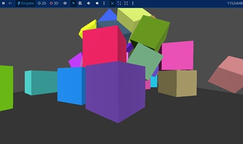

# YaGoSl
Yet another Godot Squirrel

its a new script-language for godot. edit your nut-files with the editor of your choice    
and type the name of the .nut-file in the godotsquirrel-node in inspector.      
    
godotsquirrel is a new node for godot that inherits from Node.    
the advantages of YaGoSl are that _ready, _process, _physics_process    
and _input functions work in squirrel.    
    
WIP - programmed with godot 4.5, squirrel 3.2. thx to Alberto Demichelis for squirrel.
tested on windows 11. 
    
  

second example node3d.nut:    



# commands:       
print(string)    
    
node = get_node(nodename) // stores the id     
    
create_node(parentnode.id, nodename) // instatiate and add_child - for example: local lbl = create_node("Label")   

instantiate(node/object) // (refCounted objects are hardcoded, add missing refCounted...)    
// local mat = instantiate("StandardMaterial3D")    
    
set_property(node.id, property, value)    
// for example: set_property(lbl.id, "text", "this is YaGoSl")    
// other example with vector2: set_property(id, "scale", { x = 1.5, y = 1.5 })    
// or set_property with color (id, "modulate", { r=1, g=0.2, b=0.2 })    

set_property_object(object.ptr, property, value    
// example: set_property_object(mat, "albedo_color", {r=0.0, g=0.0, b=1.0, a=1.0})    
    
get_property(node.id, property)    
// example: local pos = get_property(sprite.id, "position")    

get_property_object(object.raw, property)    
// example:    
// local c = get_property_object(boxmat.raw, "albedo_color")    
// if (typeof c == "table") {    
//    print("r = " + c.rawget("r"))    
//    print("g = " + c.rawget("g"))    
//    print("b = " + c.rawget("b"))    
//    print("a = " + c.rawget("a"))    
// } else {    
//    print("Kein Table, sondern: " + typeof c)    
// }    
    
call_method // examples:    
// local sprite = call_method(my_node, "get_node", "Sprite2D")    
// local parent = call_method(my_node, "get_parent")    
// local grandparent = call_method(call_method(my_node, "get_parent"), "get_parent")    
// call_method(my_node, "set_visible", false)    
// call_method(target_node, "queue_free")   
// local tree = call_method(my_node, "get_tree")    
// call_method(my_node, "emit_signal", "player_scored", 10)    
// if (call_method(my_node, "is_in_group", "enemies")) { print("enemy!") }    
    
load_resource    
// example: local tex = load_resource("res://icon.svg")    
// and then: set_property(sprite.id, "texture", tex)    
    
randint(range), randfloat(range), srand(seed)    
// example: srand(42)    
// local rand = randint(100).randomnumber // integernumbers from 0 to 99    

    

# example test.nut in project demo lets the sprite fly:    
```
// Squirrel Code

parent <- null // global variables
sprite <- null
timepassed <- 0

function _ready() {
    print("hello world from squirrel ready")
    parent <- get_node("GodotSquirrel")
    print("parentid: " + parent.id)
    sprite <- create_node(parent.id, "Sprite2D")
    print("id: " + sprite.id)
    if (sprite == null) {
        print("node not found")
        return
    }
    local tex = load_resource("res://icon.svg")
    set_property(sprite.id, "texture", tex)
    local pos = get_property(sprite.id, "position")
    local new_x = 80
    local new_y = 150
    set_property(sprite.id, "position", { x = new_x, y = new_y })

    local lbl = create_node(parent.id, "Label")
    set_property(lbl.id, "text", "this is YaGoSl - press key or mouse to test input")
    set_property(lbl.id, "position", { x = 20, y = 20 })
    set_property(lbl.id, "scale", { x = 2.5, y = 2.5 })
}

function _process(delta) {
    timepassed <- timepassed + delta
    
    if (!sprite) return
    local pos = get_property(sprite.id, "position")
    local new_x = pos.x + timepassed
    local new_y = pos.y
    if (timepassed > 6) {
        timepassed <- 0
        new_x = 0
    }
    set_property(sprite.id, "position", { x = new_x, y = new_y })
}

function _input(event) {
    //print("event! type: " + event.type);
    
    if (event.type == "key" && event.pressed) {
        print("key: " + event.unicode.tochar());
    }
    
    if (event.type == "mouse" && event.pressed) {
        print("mouseclick: " + event.button + " at " + event.x);
    }
}
```

    
# build:    
put squirrel version 3.2 to directory src/squirrel-3.2    
put godot-cpp version 4.5 to directory godot-cpp    


# last changes:
- new commands create_node and set_property (see list commands)
- now set_property works also with vector2 (example: set_property(id, "position", { x = 10, y = 20 }))
- set_property also with vector3, bool, color, dictionary, array
- new command get_proterty equal to set_property
- new command call_method
- _input function for key and mouse-events
- new command load_resource
- new commands set_property_object and instantiate (refCounted objects are hardcoded, add missing refCounted...)
- new commands randint, randfloat, srand and new example node3d.nut in directory examples
- new command get_property_object, function _physics_process    
  
  
  
  
